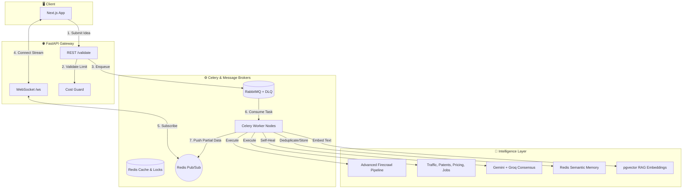
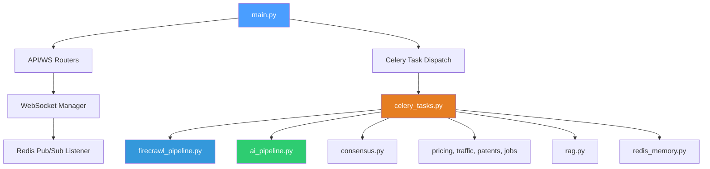

# StartupScope AI: System Architecture & Technical Documentation

> **Version:** 2.0
> **Language / Runtime:** Python 3.10+ · FastAPI · Celery · Next.js 14
> **Architecture style:** Event-Driven Async Workers → Real-Time Progressive Streaming → Parallel Data & AI Consensus Pipelines

---

## Table of Contents

1. [System Overview](#1-system-overview)
2. [Architecture Breakdown](#2-architecture-breakdown)
3. [Execution Flow (The Handoff)](#3-execution-flow-the-handoff)
4. [Advanced Firecrawl Data Gathering](#4-advanced-firecrawl-data-gathering)
5. [Three-Tier Redis Memory Engine](#5-three-tier-redis-memory-engine)
6. [Multi-Model Consensus & Self-Healing](#6-multi-model-consensus--self-healing)
7. [Parallel Data Pipelines](#7-parallel-data-pipelines)
8. [Progressive WebSocket Streaming](#8-progressive-websocket-streaming)
9. [Cost Guard & Rate Limiting](#9-cost-guard--rate-limiting)
10. [Temporal Tracking & Smart Alerts](#10-temporal-tracking--smart-alerts)

---

## 1. System Overview

### Purpose
StartupScope AI is an **enterprise-grade idea validation assistant**. It addresses the challenge of market research and competitor analysis by synthesizing vast amounts of live web data to validate a startup idea. It uses parallel data pipelines and multi-model AI consensus to deliver highly grounded and balanced insights.

### Core Innovation
The system implements a highly resilient, event-driven architecture:
1. **Real-Time Data Gathering:** Utilizing Firecrawl for deep competitor scraping, paired with parallel pipelines for funding, pricing, patents, jobs, and web traffic.
2. **Generative Consensus:** Combines Gemini 1.5 Pro / 2.5 Flash (for deep reasoning) and Groq Llama 3.1 70B (for speed and fallback) to create bias-reduced validation reports.
3. **Self-Healing LLMs:** A built-in validation loop that catches malformed JSON from LLMs and automatically re-prompts them with exact Pydantic schemas.
4. **Progressive Streaming:** Dispatches JSON events over Redis Pub/Sub the *instant* individual pipeline sections finish, enabling a snappy UI experience without waiting for the full 5-minute task.

### High-Level Architecture



---

## 2. Architecture Breakdown

### Folder Structure & File Responsibilities

```text
startupscope-ai/
├── backend/
│   ├── app/
│   │   ├── main.py                  # FastAPI entry point; exposes REST & WebSocket routes.
│   │   ├── api/                     # Route definitions (ws_router.py, validation.py).
│   │   ├── worker/
│   │   │   └── celery_tasks.py      # The Heavy Lifter: Orchestrates the entire async validation pipeline.
│   │   ├── services/
│   │   │   ├── ai_pipeline.py       # Gemini & Groq singletons, embeddings, self-healing output loops.
│   │   │   ├── consensus.py         # Merges Gemini and Groq outputs intelligently.
│   │   │   ├── firecrawl_pipeline.py# Search->Rank->Scrape->Extract workflow.
│   │   │   ├── redis_memory.py      # Three-tier idea history, cache, and semantic vectors.
│   │   │   ├── rag.py               # Text chunking and retrieval from Supabase pgvector.
│   │   │   ├── cost_guard.py        # Validates user credit balance and reconciles API spend.
│   │   │   ├── temporal.py          # Calculates semantic drift across validation versions.
│   │   │   ├── traffic.py, pricing.py, patents.py, funding.py, jobs.py # Parallel data extraction modules.
│   │   │   └── webhooks.py          # Outbound dispatch system for completed validations.
│   │   └── websockets/
│   │       ├── manager.py           # Maps connected clients to validation IDs.
│   │       └── redis_listener.py    # Listens to Redis channels and pushes to WS manager.
├── frontend/
│   └── (Next.js 14+ App Router & Zustand State)
└── README.md
```

### Dependency Relationships



---

## 3. Execution Flow (The Handoff)

StartupScope AI relies on an **Anchor & Handoff** pattern to prevent blocking web requests while heavy processing occurs.

1. **User Request (FastAPI):** User POSTs a startup idea.
2. **Pre-flight & Anchor:** `cost_guard.py` checks limits. FastAPI instantly writes a `pending` row to **Supabase**.
3. **The Handoff:** FastAPI queues the task to **RabbitMQ**. The API responds instantly with `202 Accepted`.
4. **WebSocket Connection:** The frontend connects to `/ws/validation/{id}`.
5. **Worker Execution (Celery):** The worker picks up the task, secures a distributed lock via Redis, and begins processing.
6. **Progressive Streaming:** As each module (Consensus, Pricing, Patents) finishes, the worker publishes a JSON event to Redis Pub/Sub, which FastAPI streams directly to the waiting frontend.
7. **Write-Through:** Upon full completion, the final massive JSON payload is anchored back to Supabase.

---

## 4. Advanced Firecrawl Data Gathering

The data discovery phase operates far beyond simple web search. `firecrawl_pipeline.py` executes a multi-step heuristic loop:

1. **LLM Query Generation:** Generates 5 high-intent search queries based on the idea.
2. **Broad Search:** Hits the Firecrawl Search API returning Markdown.
3. **Re-ranking:** An LLM scores results for actual SaaS relevance to filter out blogs and SEO spam.
4. **Deep Scrape:** Targeted `/scrape` calls on the top competitor domains.
5. **Structured Extraction & Gap Search:** Pydantic-enforced extraction. If gaps are missing, a second targeted search query is dynamically spawned.

---

## 5. Three-Tier Redis Memory Engine

To prevent redundant API calls and inject historical learning, `redis_memory.py` implements three tiers:

- **Tier 1 (Cache):** Exact request deduplication to save scraping costs (1-hour TTL).
- **Tier 2 (Idea History):** Structured logs of past validation scores and identified market gaps (90-day TTL).
- **Tier 3 (Semantic Vectors):** Utilizes `embed_text` (Gemini 768-dim) and cosine similarity to find highly related *past* ideas. These past insights are injected directly into the LLM prompt of new ideas to inform it of historical failures or pivots.

---

## 6. Multi-Model Consensus & Self-Healing

Relying on a single LLM for validation risks massive bias. We implement a **Consensus Engine**:

- **Parallel Generation:** Both **Gemini 1.5 Pro** and **Groq (Llama 3.1 70B)** run concurrently. 
- **Self-Healing Loop:** If either model outputs malformed JSON or hallucinates outside the Pydantic schema, `tenacity` intercepts the error and re-prompts the model, explicitly showing it the broken JSON and the exact Python schema exception.
- **Merge Logic:** `consensus.py` intelligently merges the two dictionaries, comparing numerical feasibility scores to generate a `consensus_confidence` metric.

---

## 7. Parallel Data Pipelines

Secondary data extraction modules are fired off simultaneously:

| Module | Mechanism | Extracted Value |
|--------|-----------|-----------------|
| **Traffic** | `traffic.py` | Scrapes external SEO/Traffic endpoints for competitor visitor metrics. |
| **Patents** | `patents.py` | Queries USPTO and EPO for IP moats related to the idea. |
| **Jobs** | `jobs.py` | Analyzes competitor hiring portals for strategic direction clues. |
| **Funding**| `funding.py` | Checks public ledgers for recent capital raises. |
| **Pricing**| `pricing.py` | Extracts tiered pricing tables directly from markdown. |

---

## 8. Progressive WebSocket Streaming

Because the full Celery task can take 30-90 seconds, waiting for a REST response is unacceptable for UX. 
`celery_tasks.py` publishes partial events:

```json
{
  "validation_id": "uuid",
  "status": "processing",
  "section": "patents",
  "data": { ... }
}
```
The FastAPI `redis_listener.py` catches this and pushes it over the active WebSocket, allowing the Next.js frontend to render "cards" dynamically as they load.

---

## 9. Cost Guard & Rate Limiting

Validating an idea dynamically costs money per API hit. `cost_guard.py` ensures:
- Pre-flight estimation: Predicts token and search costs. Blocks requests if user balance is low.
- Reconciliation: After the task completes, exact Gemini tokens and Firecrawl credits are calculated and securely deducted from the Supabase wallet table.

---

## 10. Temporal Tracking & Smart Alerts

Founders often validate the same idea multiple times over months.
- `temporal.py` compares the new validation against the previous version using semantic drift logic.
- If major market changes are detected (e.g., a competitor suddenly raised $5M, or a new feature gap appeared), `alerts.py` dispatches immediate outbound webhooks or email alerts.
