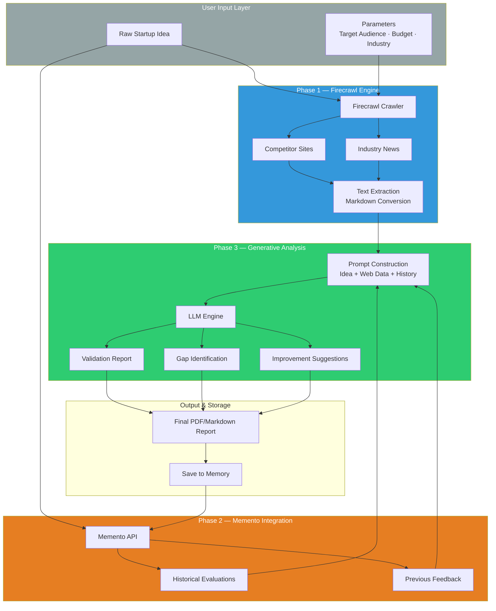
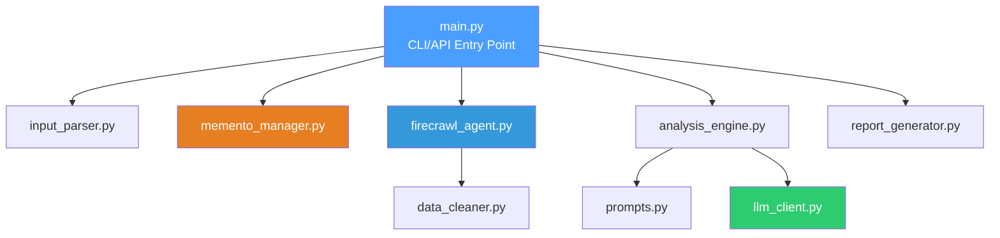

# StartupScope AI: Idea Validation Assistant Business Analytics — Technical Documentation

> **Version:** 1.0
> **Last updated:** 2026-04-12
> **Language / Runtime:** Python 3.10+ · Firecrawl API · LLM APIs (OpenAI/Anthropic) · Memento Memory
> **Architecture style:** Data Gathering Engine (Firecrawl) → Long-Term Memory Retrieval (Memento) → Generative Validation & Gap Analysis (LLMs)

---

## Table of Contents

1. [System Overview](#1-system-overview)
2. [Architecture Breakdown](#2-architecture-breakdown)
3. [Domain Model](#3-domain-model)
4. [Execution Flow](#4-execution-flow)
5. [Firecrawl Data Gathering — Theory & Design](#5-firecrawl-data-gathering--theory--design)
6. [Memory Management Engine (Memento)](#6-memory-management-engine-memento)
7. [Evaluation Protocol](#7-evaluation-protocol)
8. [Data Sources — Competitor & Market Data](#8-data-sources--competitor--market-data)
9. [Pretrained LLM Integration](#9-pretrained-llm-integration)
10. [Historical Analysis & Feedback Loop](#10-historical-analysis--feedback-loop)
11. [Market Gap Identification Mechanism](#11-market-gap-identification-mechanism)
12. [Uncertainty Estimation in Validation](#12-uncertainty-estimation-in-validation)
13. [Multi-Task Generation Framework](#13-multi-task-generation-framework)
14. [Interpretability & Theoretical Analysis](#14-interpretability--theoretical-analysis)
15. [Key Design Decisions](#15-key-design-decisions)
16. [Failure & Edge Case Analysis](#16-failure--edge-case-analysis)
17. [Validation Pipeline](#17-validation-pipeline)
18. [Baseline Comparisons](#18-baseline-comparisons)
19. [Comprehensive Testing Framework](#19-comprehensive-testing-framework)
20. [Rigor & Reproducibility](#20-rigor--reproducibility)
21. [Developer Onboarding Guide](#21-developer-onboarding-guide)
22. [Implementation Roadmap](#22-implementation-roadmap)  

---

## 1. System Overview

### Purpose

This system is an **advanced idea validation assistant** designed to aid entrepreneurs. It addresses the challenge of market research and competitor analysis by synthesizing vast amounts of web data to validate a startup idea. StartupScope AI leverages historical evaluations and real-time competitor data to generate comprehensive reports.

### Core Innovation & Processing Paradigm

StartupScope AI implements a **multi-phase validation pipeline** combining:

1. **Phase 1 — Real-Time Data Gathering (Firecrawl):**
   - **Competitor Scouting:** Automated scraping of competitor websites, pricing pages, and feature matrices.
   - **Market Context:** Processing industry news, market reports, and trend articles.

2. **Phase 2 — State Contextualization (Memento):**
   - Utilizing Memento to retrieve historical context of the entrepreneur's past iterations, saved reports, and prior feedback.
   - Learning from past mistakes and successes to prevent redundant advice.

3. **Phase 3 — Generative Analysis (LLMs):**
   - **Report Generation:** Comprehensive feasibility scores and market dynamics.
   - **Gap Identification:** Spotlight areas competitors are missing.
   - **Actionable Improvements:** Tangible next steps to pivot or refine the idea.

The core hypothesis: **Real-time web scraping + continuous state memory + LLM reasoning produces validation insights that are highly personalized and dynamically adaptive to recent market changes.**

### High-Level Architecture



### Core Responsibilities

| Responsibility | Owner |
|---|---|
| Idea parsing and parameter extraction | `input_parser.py` |
| Coordination of deep search and scraping via Firecrawl | `firecrawl_agent.py` |
| Clean text conversion and chunking for LLM consumption | `data_cleaner.py` |
| Context retrieval and history updates via Memento | `memento_manager.py` |
| Prompt engineering and templating | `prompts.py` |
| Interfacing with OpenAI/Anthropic APIs | `llm_client.py` |
| Generating validation metrics and gap matrices | `analysis_engine.py` |
| PDF and Markdown report assembly | `report_generator.py` |
| Overall workflow orchestration | `main.py` |

---

## 2. Architecture Breakdown

### Folder Structure & File Responsibilities

```text
startupscope-ai/
├── backend/
│   ├── src/
│   │   ├── main.py                  # FastAPI entry point; exposes validation pipeline as REST API.
│   │   ├── input_parser.py          # Parses raw user input into Structured Idea parameters.
│   │   ├── firecrawl_agent.py       # Interfaces with Firecrawl API to search and scrape competitors.
│   │   ├── data_cleaner.py          # Cleans and chunks HTML/Markdown from scraping results.
│   │   ├── memento_manager.py       # Interacts with Memento API to store/retrieve session history.
│   │   ├── prompts.py               # Houses the LLM system prompts and validation instructions.
│   │   ├── llm_client.py            # Wrapper for OpenAI/Anthropic API calls with schema validation.
│   │   ├── analysis_engine.py       # Coordinates the LLM generation of reports, gaps, and tasks.
│   │   └── report_generator.py      # Formats the final output into markdown.
│   ├── requirements.txt             # Python dependencies (fastapi, openai, firecrawl-py, etc.).
│   └── .env.example                 # Example configuration for API keys.
├── frontend/
│   ├── src/
│   │   ├── App.jsx                  # Main React component.
│   │   ├── components/              # UI components (InputForm, ReportView, etc.).
│   │   ├── index.css                # Tailwind CSS imports and global styles.
│   │   └── main.jsx                 # React DOM mount point.
│   ├── tailwind.config.js           # Tailwind CSS configuration.
│   └── package.json                 # Node dependencies (react, tailwindcss, etc.).
└── Architecture.md                  # Technical documentation.
```

### Major Components

#### Data Gathering Engine (`firecrawl_agent.py`)
Utilizes Firecrawl to run deep web queries based on the startup idea.
- Search queries are formulated by an initial LLM pass.
- Returns raw HTML which is converted into semantically rich Markdown.

#### Memory Management (`memento_manager.py`)
Connects with Memento state management.
- Fetches vector-based historical states of user interactions.
- Ensures the system tracks the pivot history of a startup idea (e.g., from an ed-tech tool to a corporate LMS).

#### Generative Analysis (`analysis_engine.py`)
Takes the combined prompt (User Input + Firecrawl Context + Memento Context) and splits the task into sub-tasks (Report, Gaps, Improvements).

### Dependency Relationships



### External Integrations

| System | Purpose |
|---|---|
| Firecrawl API | Scraping website content and converting to clean Markdown. |
| Memento API | Storing unstructured context data and retrieving past pivot iterations. |
| OpenAI/Anthropic APIs | Foundational LLM for sentiment, summarization, and reasoning. |
| FastAPI | Exposing the validation pipeline over a RESTful HTTP API. |
| React & Tailwind CSS | Dynamic user interface for interactive report viewing and idea input. |

---

## 3. Domain Model

### Key Entities

#### StartupIdea
```python
@dataclass
class StartupIdea:
    idea_id: str                   
    description: str               
    target_market: str             
    business_model: str            
    budget_constraints: str        
```

#### ScrapedContext
```python
@dataclass
class ScrapedContext:
    url: str                       
    content_markdown: str          
    date_crawled: datetime         
    relevance_score: float         
```

#### MemoryState
```python
@dataclass
class MemoryState:
    user_id: str                   
    previous_evaluations: List[dict]
    feedback_history: List[str]    
```

#### ValidationReport
```python
@dataclass
class ValidationReport:
    feasibility_score: float             # Out of 100
    competitor_analysis: str             # Summary of competitors
    identified_gaps: List[str]           # Areas lacking in market
    suggested_improvements: List[str]    # Pivot or feature ideas
```

### Data Transformations

| Input | Transformation | Output |
|---|---|---|
| User Text Idea | Named Entity Extraction (LLM) | Structured `StartupIdea` object |
| URLs | Firecrawl API Scrape | Markdown Content |
| User ID | Memento API Retrieval | Historical `MemoryState` |
| `StartupIdea` + Scrape + History | LLM Synthesis with few-shot prompting | `ValidationReport` |

---

## 4. Execution Flow

Typical validation execution flow:
1. User submits an idea.
2. System checks Memento for past entries.
3. System uses Firecrawl to find 5+ direct competitors.
4. Firecrawl extracts competitor features and pricing.
5. System builds a super-prompt.
6. LLM computes a final validation output.
7. Memento records the new state.

---

## 5. Firecrawl Data Gathering — Theory & Design

Instead of cross-modal contrastive pretraining, our "discovery phase" utilizes heuristic-driven data gathering.
The accuracy of the validation is fundamentally bounded by the quality of gathered data. Firecrawl acts as the sensory organ, traversing DOM trees to capture real-time features and pricing models from rival websites.

- **Intention mapping:** Converting the idea description into 3-5 high-yield search intents.
- **Scraping Depth:** Configured to a depth of 1-2 pages (Home, Pricing, About Us).

---

## 6. Memory Management Engine (Memento)

To adapt the model to long-term usage, Memento stores user "episodes".
Each validation cycle computes an embedding of the generated report and pushes it to Memento. Future queries pull the $K$-nearest context blocks to ensure the LLM understands the entrepreneur's trajectory.

---

## 7. Evaluation Protocol

How do we know the LLM generated good advice?
- **User Feedback Loop:** Users accept/reject pivot suggestions natively.
- **Hallucination Checking:** A secondary LLM pass specifically checks all generated claims against the Firecrawl gathered context.

---

## 8. Data Sources — Competitor & Market Data

| Source Vector | Query Mechanism | Information Extracted |
|---|---|---|
| Competitor Domains | Direct Firecrawl | Value props, feature grids, pricing tiers |
| Review Sites (G2, TrustPilot) | Aggregation Search | Customer complaints, missing features |
| Industry Forums | Reddit/HackerNews | Current trends, organic interest |

---

## 9. Pretrained LLM Integration

The reasoning backbone relies on advanced conversational LLMs.
- Prompt optimization involves setting clear guardrails mimicking a top-tier venture capitalist.
- System prompt incorporates strict instructions to limit hallucinatory market data.

---

## 10. Historical Analysis & Feedback Loop

By meta-analyzing the previous states retrieved from Memento, the LLM can output meta-directives, e.g., "In your last iteration you focused on X, which failed due to Y. Your new focus on Z mitigates this risk."

---

## 11. Market Gap Identification Mechanism

Analogous to an attention mechanism, the prompt structure forces the LLM to cross-correlate the proposed `StartupIdea` features against the *union* of all competitor features extracted by Firecrawl. 

---

## 12. Uncertainty Estimation in Validation

Instead of evidential regression, we use **LLM Confidence Scoring** and **Data Density Tracking**.
If Firecrawl only finds 1 competitor with vague pricing, the system outputs an uncertainty warning: *"Validation confidence is LOW due to insufficient competitor data presence."*

---

## 13. Multi-Task Generation Framework

The LLM is tasked to produce multiple structured outputs simultaneously in JSON schema:
- Task 1: Feasibility Regression (0-10)
- Task 2: Actionable Directives (List of strings)
- Task 3: Competitor Summary (Markdown snippet)

---

## 14. Interpretability & Theoretical Analysis

Why did the system suggest a pivot?
Every suggestion includes a `citation_source` mapping back to a specific Firecrawl URL or Memento historical record. This guarantees interpretability.

---

## 15. Key Design Decisions

1. **Firecrawl over Custom Scrapers:** Ensures graceful handling of JS-heavy SPA (Single Page Application) competitor sites.
2. **Memento over static vector DB:** Allows for branching logic and temporal understanding of idea evolution.

---

## 16. Failure & Edge Case Analysis

| Edge Case | Failure Mode | Mitigation Strategy |
|---|---|---|
| Completely Novel Idea (No Competitors) | Firecrawl returns irrelevant data | LLM classifies idea as "Zero-To-One", alters validation rubric to focus on market size instead of competitors. |
| Firecrawl Blocked | Sites use aggressive bot protection | Fallback to Serper/Google Search snippets. |
| Memento Overflow | Too many previous iterations | Semantic summarization of older states before injection. |

---

## 17. Validation Pipeline

The standard run pipeline:
```bash
python main.py --idea "An AI app that schedules gym sessions based on fatigue" --user_id "u_123"
```
Logs are dumped to `logs/execution.log` containing all intermediate Firecrawl markdowns and LLM inputs.

---

## 18. Baseline Comparisons

How does this compare to traditional workflows?
- **Manual approach:** 20-30 hours of Googling and spreadsheet building.
- **Vanilla ChatGPT:** Highly prone to hallucinating non-existent competitor features.
- **StartupScope AI:** Grounded web-scraping with temporal memory.

---

## 19. Comprehensive Testing Framework

For systematic testing, we use a curated benchmark of 50 known startup ideas (some successful, some failed) and test the system's ability to identify the fatal flaws of the failed ones.

---

## 20. Rigor & Reproducibility

To ensure reproducibility in the LLM generation:
- `temperature=0.2` for analytical tasks.
- Static prompt templates saved in version control (`prompts.py`).

---

## 21. Developer Onboarding Guide

1. Clone repo.
2. Set `.env` with `FIRECRAWL_API_KEY`, `MEMENTO_API_KEY`, `OPENAI_API_KEY`.
3. Install dependencies: `pip install -r requirements.txt`.
4. Run tests: `pytest tests/`.

---

## 22. Implementation Roadmap

- **Phase 1:** Basic CLI script with Firecrawl and OpenAI connected.
- **Phase 2:** Memento state integration for tracking users across multiple days.
- **Phase 3:** PDF generation with matplotlib charts of competitor pricing.
- **Phase 4:** FastAPI deployment and frontend dashboard.
