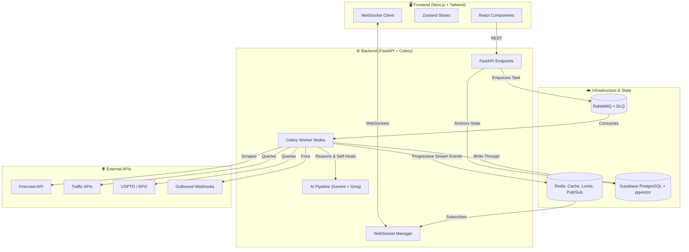
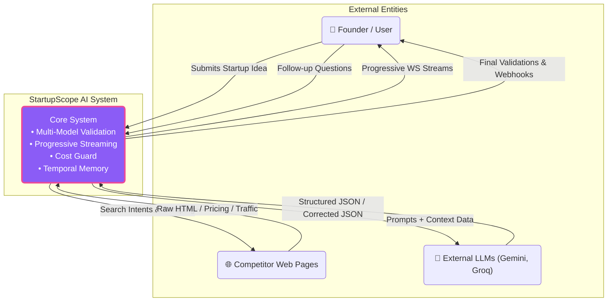
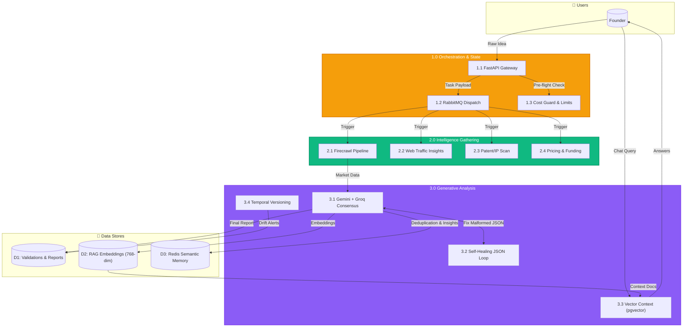
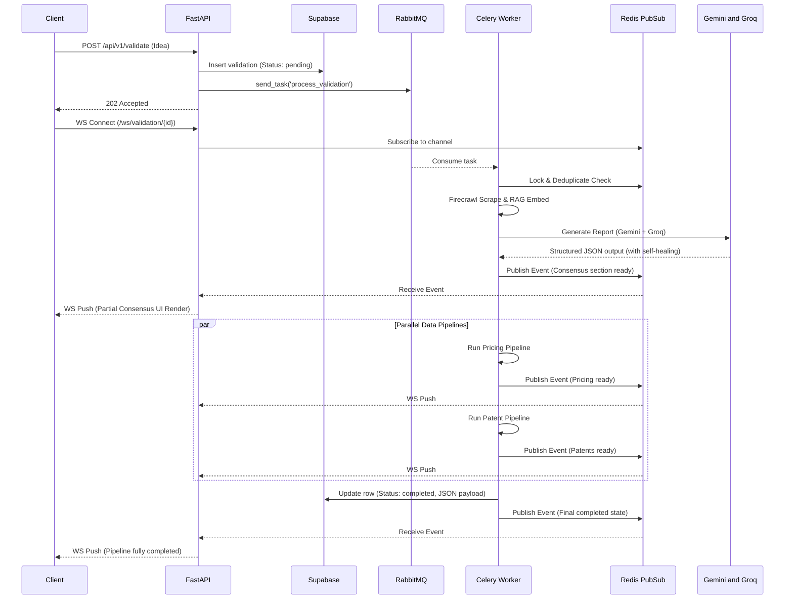
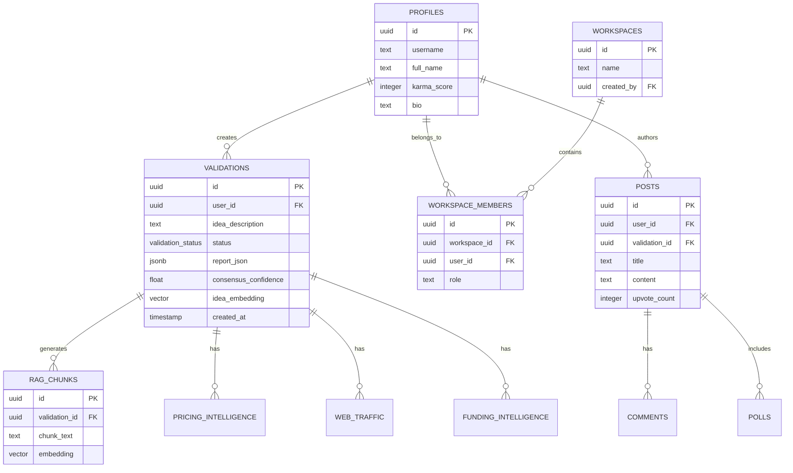

<div align="center">

# 🚀 StartupScope AI

### The Ultimate Idea Validation & Business Analytics Assistant

[](https://nextjs.org/)
[](https://fastapi.tiangolo.com/)
[](https://www.python.org/)
[](https://supabase.com/)
[](https://redis.io/)
[](https://www.rabbitmq.com/)

*A cutting-edge, agentic AI platform that validates startup ideas using real-time market data, competitor intelligence, and multi-model consensus, guiding founders from raw concepts to market-ready strategies.*

[Features](#-features) • [Architecture](#-architecture) • [Data Flow Diagrams](#-data-flow-diagrams) • [API Reference](#-api-reference) • [Installation](#-installation) • [Tech Stack](#-tech-stack)

</div>

---

## ✨ Features

### 🧠 Advanced AI Validation Engine
- **Multi-Model Consensus:** Leverages Gemini (1.5 Pro / 2.5 Flash) for deep analysis and Groq (Llama 3.1 70B) for speed/fallback, merging outputs to provide balanced, bias-reduced evaluations.
- **Self-Healing Structured Output:** Built-in auto-correction loop that catches malformed AI outputs and re-prompts models with exact Pydantic schemas until validation succeeds.
- **Conversational RAG (Ask Your Report):** Uses native 768-dimensional Gemini `text-embedding-004` vectors stored in `pgvector` to semantically search and ground the AI's responses in real market data.
- **Three-Tier Redis Memory Storage:** Automatically deduplicates requests and injects historical insights from similar past ideas into the AI's context window.

### 🕵️ Real-Time Intelligence & Web Gathering
- **Advanced Firecrawl Pipeline:** An intelligent Search → Rank → Scrape → Extract cycle for deep competitor discovery.
- **Pricing & Funding Intelligence:** Automatically scrapes competitor pricing models and aggregates recent funding rounds.
- **Patent & IP Moat Scan:** Uses USPTO and EPO open APIs to check for potential patent conflicts or moats.
- **Job Posting Signal:** Analyzes competitor hiring trends as a proxy for their strategic direction.
- **Web Traffic Intelligence:** Extracts competitor traffic and engagement metrics to estimate market share.

### ⚡ Enterprise-Grade Infrastructure
- **Progressive Streaming:** Sections of the report (e.g., pricing, funding, patents) are pushed to the UI via WebSockets the *instant* they finish, rather than waiting for the entire pipeline.
- **Asynchronous Processing:** Robust background orchestration using RabbitMQ, Celery with Priority & Dead Letter Queues, and Distributed Redis Locks.
- **Cost Guard & Smart Alerts:** Pre-flight cost estimation, API charge reconciliation, and temporal drift tracking that triggers webhooks/alerts when your startup's market landscape changes significantly.

### 👥 Collaboration & Social
- **Team Workspaces:** Invite co-founders and advisors with role-based access control (Owner, Editor, Viewer).
- **Discord for Founders (Arena & Nexus):** A built-in social network to post validations, poll the community, and upvote/downvote ideas.
- **PDF Export:** Generate beautiful, dark-mode PDF pitch decks and reports from your validations using WeasyPrint.

---

## 🏗 Architecture

The system is split into a **Next.js Frontend** and a **FastAPI + Celery Backend**, backed by **Supabase (PostgreSQL)**, **Redis**, and **RabbitMQ**.

### High-Level Architecture Diagram



---

## 📊 Data Flow Diagrams

### Level 0 DFD (Context Diagram)



### Level 1 DFD



---

## 🧩 Sequence & Class Diagrams

### Core Validation Sequence Diagram



### Entity Relationship (Class) Diagram



---

## 📡 API Reference

### Validation Engine
| Method | Endpoint | Description |
|--------|----------|-------------|
| `POST` | `/api/v1/validate` | Submits a new idea for background AI processing. |
| `GET`  | `/api/v1/validate/{id}` | Fetches the completed validation report (Cache-Aside). |
| `WS`   | `/ws/validation/{id}` | Real-time progressive WebSocket stream for pipeline milestones. |
| `POST` | `/api/v1/validate/{id}/summarize` | Generates an AI summary of a completed report. |

### RAG & AI Chat
| Method | Endpoint | Description |
|--------|----------|-------------|
| `POST` | `/api/v1/chat/{validation_id}` | Ask follow-up questions grounded in the report data. |
| `POST` | `/api/v1/compare` | Compare multiple startup ideas using a VC-like matrix. |

### Collaboration & Export
| Method | Endpoint | Description |
|--------|----------|-------------|
| `POST` | `/api/v1/workspaces` | Create a new shared workspace. |
| `POST` | `/api/v1/workspaces/{id}/invite` | Invite users via email to collaborate. |
| `GET`  | `/api/v1/export/{id}/pdf` | Generates and returns a signed URL for a PDF pitch deck. |

---

## 🛠 Tech Stack

### Frontend
- **Framework:** Next.js 14+ (App Router)
- **Styling:** Tailwind CSS + Framer Motion
- **State Management:** Zustand
- **Auth:** Supabase Auth Helpers

### Backend
- **Framework:** FastAPI (Python 3.10+)
- **Task Queue:** Celery + RabbitMQ (with Dead Letter Queues)
- **Cache & Pub/Sub:** Redis
- **Database:** Supabase (PostgreSQL) + pgvector
- **AI/LLMs:** Google Gemini (1.5-Pro / 2.5-Flash), Groq (Llama 3.1 70B), Gemini `text-embedding-004`
- **Resilience:** Tenacity (for self-healing AI outputs)
- **Web Scraping:** Firecrawl

---

## 🚀 Installation & Local Setup

### 1. Prerequisites
- Docker & Docker Compose
- Python 3.10+
- Node.js 18+
- Supabase Account (or local Supabase stack)

### 2. Infrastructure Setup (Redis & RabbitMQ)
We use Docker to spin up the message broker and cache layer.

```bash
cd backend
docker compose up -d
```

### 3. Backend Setup
```bash
cd backend
python -m venv venv
source venv/bin/activate  # On Windows: .\venv\Scripts\activate
pip install -r requirements.txt

# Create .env and fill in API keys
cp .env.example .env

# Run FastAPI Server
uvicorn app.main:app --reload --port 8000

# In a separate terminal, run the Celery Worker
celery -A app.worker.celery_tasks worker --loglevel=info
```
*(Alternatively, use `./startup.sh` if running on Unix to boot everything at once).*

### 4. Frontend Setup
```bash
cd frontend
npm install

# Create .env.local and add Supabase URL and Anon Key
cp .env.example .env.local

npm run dev
```
The application will be available at `http://localhost:3000`.

---

## 📄 License

This project is proprietary. All rights reserved. Built for the founders of tomorrow.

<div align="center">
<b>Validate Faster. Pivot Smarter. Build Better.</b>
</div>