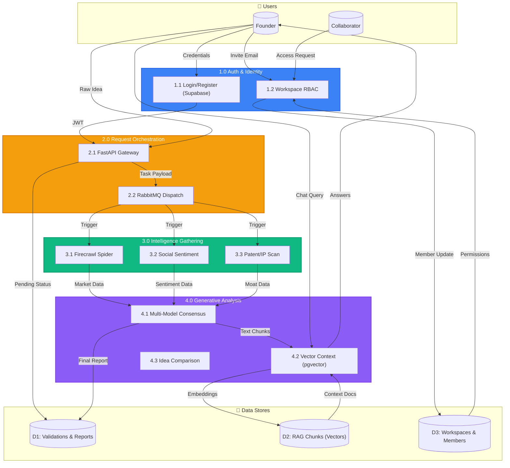
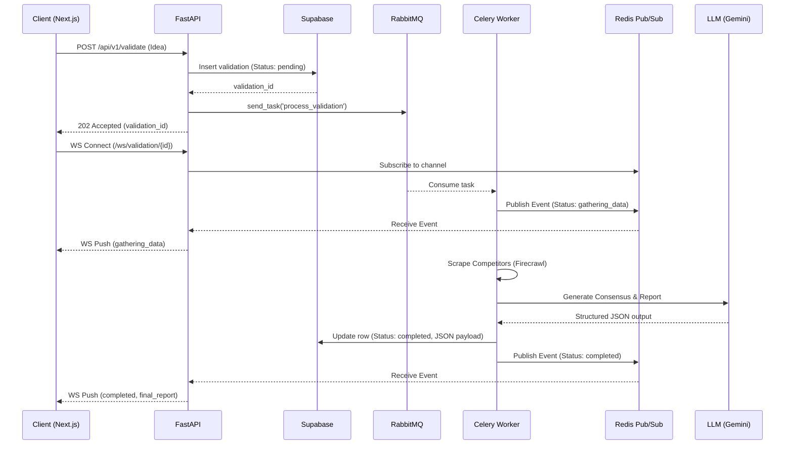
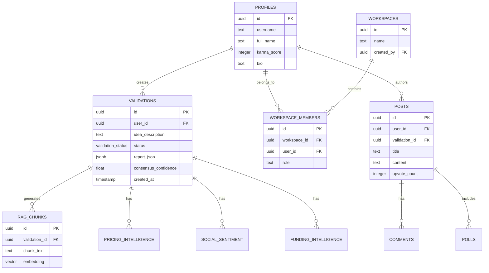

<div align="center">

# 🚀 StartupScope AI

### The Ultimate Idea Validation & Business Analytics Assistant

[](https://nextjs.org/)
[](https://fastapi.tiangolo.com/)
[](https://www.python.org/)
[](https://supabase.com/)
[](https://redis.io/)
[](https://www.rabbitmq.com/)

*A cutting-edge, agentic AI platform that validates startup ideas using real-time market data, competitor intelligence, and multi-model consensus, guiding founders from raw concepts to market-ready strategies.*

[Features](#-features) • [Architecture](#-architecture) • [Data Flow Diagrams](#-data-flow-diagrams) • [API Reference](#-api-reference) • [Installation](#-installation) • [Tech Stack](#-tech-stack)

</div>

---

## ✨ Features

### 🧠 Advanced AI Validation Engine
- **Multi-Model Consensus:** Leverages multiple LLMs (Gemini, Groq, Claude) to provide balanced, bias-reduced evaluations of your startup idea.
- **Conversational RAG (Ask Your Report):** Chat directly with your validation report. Our backend uses `pgvector` to semantically search and ground the AI's responses in real market data.
- **Idea Comparison:** Pit multiple startup ideas against each other. The AI acts as a VC judge, scoring them on capital efficiency, technical difficulty, and market size.

### 🕵️ Real-Time Intelligence & Web Gathering
- **Pricing Intelligence:** Automatically scrapes competitor pricing models and highlights gaps in the market.
- **Funding Intelligence:** Aggregates recent funding rounds of competitors.
- **Patent & IP Moat Scan:** Uses USPTO and EPO open APIs to check for potential patent conflicts or moats.
- **Job Posting Signal:** Analyzes competitor hiring trends as a proxy for their strategic direction.
- **Social Sentiment:** Aggregates market buzz from platforms like Reddit, assessing public sentiment towards competitors.

### ⚡ Enterprise-Grade Infrastructure
- **Progressive Streaming:** Real-time updates pushed directly to the UI via WebSockets and Redis Pub/Sub while the Celery worker crunches data.
- **Asynchronous Processing:** Robust background task execution using RabbitMQ, Celery, and a priority queue system with dead-letter handling.
- **Temporal Trend Tracking:** Tracks the evolution of your ideas over time and maintains historical context (Memento).

### 👥 Collaboration & Social
- **Team Workspaces:** Invite co-founders and advisors with role-based access control (Owner, Editor, Viewer).
- **Discord for Founders (Arena & Nexus):** A built-in social network to post validations, poll the community, and upvote/downvote ideas.
- **PDF Export:** Generate beautiful, dark-mode PDF pitch decks and reports from your validations using WeasyPrint.

---

## 🏗 Architecture

The system is split into a **Next.js Frontend** and a **FastAPI + Celery Backend**, backed by **Supabase (PostgreSQL)**, **Redis**, and **RabbitMQ**.

### High-Level Architecture Diagram

```mermaid
flowchart TB
    subgraph Client["🖥️ Frontend (Next.js + Tailwind)"]
        UI[React Components]
        Store[Zustand Stores]
        WS[WebSocket Client]
    end

    subgraph Backend["⚙️ Backend (FastAPI + Celery)"]
        API[FastAPI Endpoints]
        WS_Manager[WebSocket Manager]
        Worker[Celery Worker Nodes]
        AI[AI Pipeline (Gemini/Groq)]
    end

    subgraph Infrastructure["☁️ Infrastructure & State"]
        MQ[(RabbitMQ)]
        Cache[(Redis Cache & Pub/Sub)]
        DB[(Supabase PostgreSQL + pgvector)]
    end

    subgraph External["🌐 External APIs"]
        Firecrawl[Firecrawl API]
        Social[Reddit API]
        Patents["USPTO / EPO"]
    end

    Client -->|REST| API
    Client -->|WebSockets| WS_Manager
    
    API -->|Anchors State| DB
    API -->|Enqueues Task| MQ
    
    MQ -->|Consumes| Worker
    Worker -->|Scrapes| Firecrawl
    Worker -->|Queries| Social
    Worker -->|Queries| Patents
    Worker -->|Reasons| AI
    Worker -->|Updates| DB
    Worker -->|Publishes Event| Cache
    
    Cache -->|Subscribes| WS_Manager
```

---

## 📊 Data Flow Diagrams

### Level 0 DFD (Context Diagram)

```mermaid
flowchart TB
    subgraph External["External Entities"]
        Founder[("👤 Founder / User")]
        Web[("🌐 Competitor Web Pages")]
        LLMs[("🧠 External LLMs (Gemini/Groq)")]
    end

    subgraph System["StartupScope AI System"]
        Core[("Core System<br>• Idea Validation<br>• Competitor Scouting<br>• Market Analytics<br>• RAG & Synthesis")]
    end

    Founder -->|Submits Startup Idea| Core
    Founder -->|Follow-up Questions| Core
    Founder -->|Collaboration Invites| Core
    
    Core -->|Live Status Streams (WS)| Founder
    Core -->|Validation Reports (PDF/JSON)| Founder
    Core -->|Comparison Metrics| Founder

    Core -->|Search Intents / URLs| Web
    Web -->|Raw HTML / Pricing / Funding| Core
    
    Core -->|Prompts + Context Data| LLMs
    LLMs -->|Structured Analysis & Consensus| Core

    style Core fill:#8B5CF6,stroke:#EC4899,stroke-width:3px,color:#fff
```

### Level 1 DFD



---

## 🧩 Sequence & Class Diagrams

### Core Validation Sequence Diagram



### Entity Relationship (Class) Diagram



---

## 📡 API Reference

### Validation Engine
| Method | Endpoint | Description |
|--------|----------|-------------|
| `POST` | `/api/v1/validate` | Submits a new idea for background AI processing. |
| `GET`  | `/api/v1/validate/{id}` | Fetches the completed validation report (Cache-Aside). |
| `WS`   | `/ws/validation/{id}` | Real-time WebSocket stream for processing milestones. |
| `POST` | `/api/v1/validate/{id}/summarize` | Generates an AI summary of a completed report. |

### RAG & AI Chat
| Method | Endpoint | Description |
|--------|----------|-------------|
| `POST` | `/api/v1/chat/{validation_id}` | Ask follow-up questions grounded in the report data. |
| `POST` | `/api/v1/compare` | Compare multiple startup ideas using a VC-like matrix. |

### Collaboration & Export
| Method | Endpoint | Description |
|--------|----------|-------------|
| `POST` | `/api/v1/workspaces` | Create a new shared workspace. |
| `POST` | `/api/v1/workspaces/{id}/invite` | Invite users via email to collaborate. |
| `GET`  | `/api/v1/export/{id}/pdf` | Generates and returns a signed URL for a PDF pitch deck. |

---

## 🛠 Tech Stack

### Frontend
- **Framework:** Next.js 14+ (App Router)
- **Styling:** Tailwind CSS + Framer Motion
- **State Management:** Zustand
- **Auth:** Supabase Auth Helpers

### Backend
- **Framework:** FastAPI (Python 3.10+)
- **Task Queue:** Celery + RabbitMQ
- **Cache & Pub/Sub:** Redis
- **Database:** Supabase (PostgreSQL) + pgvector
- **AI/LLMs:** Google Gemini (2.0-flash), Groq (Llama 3), SentenceTransformers
- **Web Scraping:** Firecrawl

---

## 🚀 Installation & Local Setup

### 1. Prerequisites
- Docker & Docker Compose
- Python 3.10+
- Node.js 18+
- Supabase Account (or local Supabase stack)

### 2. Infrastructure Setup (Redis & RabbitMQ)
We use Docker to spin up the message broker and cache layer.

```bash
cd backend
docker compose up -d
```

### 3. Backend Setup
```bash
cd backend
python -m venv venv
source venv/bin/activate  # On Windows: .\venv\Scripts\activate
pip install -r requirements.txt

# Create .env and fill in API keys
cp .env.example .env

# Run FastAPI Server
uvicorn app.main:app --reload --port 8000

# In a separate terminal, run the Celery Worker
celery -A app.main.celery_app worker --loglevel=info
```

### 4. Frontend Setup
```bash
cd frontend
npm install

# Create .env.local and add Supabase URL and Anon Key
cp .env.example .env.local

npm run dev
```
The application will be available at `http://localhost:3000`.

---

## 📄 License

This project is proprietary. All rights reserved. Built for the founders of tomorrow.

<div align="center">
<b>Validate Faster. Pivot Smarter. Build Better.</b>
</div>