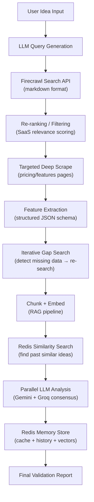

# 🏆 StartupScope AI — Advanced Firecrawl Pipeline Architecture

## Architecture Diagram

## New Files Created

| File | Purpose |
|------|---------|
| [firecrawl_pipeline.py](file:///Users/likhith./Startup_Scope_AI/backend/app/services/firecrawl_pipeline.py) | Full Search→Rank→Scrape→Extract→Iterate pipeline |
| [redis_memory.py](file:///Users/likhith./Startup_Scope_AI/backend/app/services/redis_memory.py) | Three-tier Redis memory (cache + history + vectors) |

## Files Modified

| File | Changes |
|------|---------|
| [ai_pipeline.py](file:///Users/likhith./Startup_Scope_AI/backend/app/services/ai_pipeline.py) | `firecrawl_scrape()` now delegates to advanced pipeline; added `firecrawl_scrape_advanced()` |
| [celery_tasks.py](file:///Users/likhith./Startup_Scope_AI/backend/app/worker/celery_tasks.py) | Step 5 upgraded to advanced pipeline; Step 5b adds similarity search; Step 12b adds Redis memory storage; fixed 2 `.single()` crashes |

## Pipeline Phases

### Phase A: LLM Query Generation
- Gemini generates 5 high-intent search queries (competitors, market, pricing, pain points, trends)
- Fallback to manual queries if LLM fails

### Phase B: Search with Markdown
- Firecrawl `/search` with `formats: ["markdown"]` and `onlyMainContent: true`
- Deduplicates results across queries

### Phase C: Re-ranking
- LLM scores each result 0-10 for SaaS relevance
- Filters out blogs, SEO spam, indirect competitors
- Returns top 5 most relevant results

### Phase D: Targeted Deep Scrape
- Deep scrapes top 2 competitor pages via Firecrawl `/scrape`
- Extracts full markdown with `onlyMainContent: true`

### Phase E: Structured Feature Extraction
- LLM extracts: name, features, pricing, target audience, strengths, weaknesses
- Output is structured JSON for gap analysis matrix

### Phase F: Iterative Gap Search
- LLM evaluates data completeness
- Generates follow-up queries if gaps detected (missing pricing, features, etc.)
- Max 1 iteration to control costs

## Redis Memory Architecture

### Tier 1: Cache Layer
- Key: `search:{hash}:results` (TTL: 1 hour)
- Prevents duplicate Firecrawl API calls

### Tier 2: Idea History
- Key: `idea:{validation_id}` (TTL: 90 days)
- Stores: idea, competitors, gaps, feasibility score
- User index: `user:{id}:ideas` (sorted set)

### Tier 3: Vector Similarity
- Key: `embedding:{validation_id}` (TTL: 90 days)
- 768-dim Gemini embeddings
- Python cosine similarity search
- Finds similar past ideas → injects insights into LLM prompt

## Key Design Decisions

1. **Graceful degradation**: Every phase has a fallback. Pipeline never crashes — worst case it returns the old single-query result.
2. **Cost-aware**: Limits deep scrapes to 2 pages, iterative loop to 1 round, re-ranking to 15 results.
3. **Token-efficient**: All markdown capped at 3-8K chars per source. Feature extraction produces compact structured data.
4. **Learning system**: Each completed validation stores embeddings + structured memory in Redis. Future validations benefit from historical cross-referencing.
