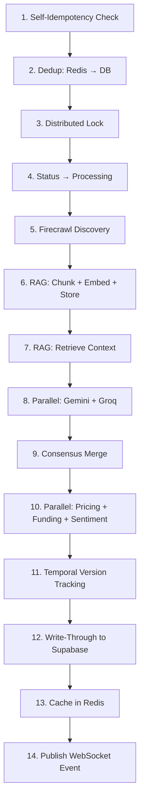

# StartupScope AI — Session 1 Walkthrough

## Summary

Implemented **7 features** across Tier 1 (Intelligence Layer) and Tier 2 (Data Pipelines) of the 20-feature upgrade. All code is production-grade, heavily-commented, and wired into a single 14-step orchestration pipeline.

---

## Features Implemented

| # | Feature | File(s) | Status |
|---|---------|---------|--------|
| 1 | Multi-Model Consensus Engine | [consensus.py](file:///Users/likhith./Startup_Scope_AI/backend/app/services/consensus.py) | ✅ Complete |
| 2 | RAG Grounding Layer | [rag.py](file:///Users/likhith./Startup_Scope_AI/backend/app/services/rag.py) | ✅ Complete |
| 3 | Structured Output + Self-Heal | [ai_pipeline.py](file:///Users/likhith./Startup_Scope_AI/backend/app/services/ai_pipeline.py), [ai_reports.py](file:///Users/likhith./Startup_Scope_AI/backend/app/schemas/ai_reports.py) | ✅ Complete |
| 4 | Temporal Trend Tracking | [temporal.py](file:///Users/likhith./Startup_Scope_AI/backend/app/services/temporal.py), [celery_beat.py](file:///Users/likhith./Startup_Scope_AI/backend/app/worker/celery_beat.py) | ✅ Complete |
| 5 | Pricing Intelligence | [pricing.py](file:///Users/likhith./Startup_Scope_AI/backend/app/services/pricing.py) | ✅ Complete |
| 6 | Funding Intelligence | [funding.py](file:///Users/likhith./Startup_Scope_AI/backend/app/services/funding.py) | ✅ Complete |
| 7 | Social Sentiment Engine | [sentiment.py](file:///Users/likhith./Startup_Scope_AI/backend/app/services/sentiment.py) | ✅ Stubbed (Reddit Rule) |

---

## Files Changed

### New Files (8)
| File | Purpose |
|------|---------|
| [ai_reports.py](file:///Users/likhith./Startup_Scope_AI/backend/app/schemas/ai_reports.py) | Single source of truth for all Pydantic v2 AI output schemas |
| [consensus.py](file:///Users/likhith./Startup_Scope_AI/backend/app/services/consensus.py) | Gemini + Groq field-by-field merge with confidence scoring |
| [rag.py](file:///Users/likhith./Startup_Scope_AI/backend/app/services/rag.py) | Chunk → embed → store → retrieve grounding pipeline |
| [pricing.py](file:///Users/likhith./Startup_Scope_AI/backend/app/services/pricing.py) | Crawl /pricing pages, Gemini extraction, gap analysis |
| [funding.py](file:///Users/likhith./Startup_Scope_AI/backend/app/services/funding.py) | TechCrunch/YC scraping, Gemini extraction, landscape synthesis |
| [sentiment.py](file:///Users/likhith./Startup_Scope_AI/backend/app/services/sentiment.py) | Reddit OAuth2 + Groq classification (commented out, Neutral fallback) |
| [temporal.py](file:///Users/likhith./Startup_Scope_AI/backend/app/services/temporal.py) | deepdiff + Gemini narrative + versioned storage |
| [celery_beat.py](file:///Users/likhith./Startup_Scope_AI/backend/app/worker/celery_beat.py) | RedBeat schedule config (weekly re-runs) |

### Modified Files (5)
| File | Changes |
|------|---------|
| [config.py](file:///Users/likhith./Startup_Scope_AI/backend/app/core/config.py) | Added GROQ_API_KEY, Reddit credentials, RedBeat URL |
| [.env](file:///Users/likhith./Startup_Scope_AI/backend/.env) | Added REDDIT_CLIENT_ID, REDDIT_CLIENT_SECRET placeholders |
| [requirements.txt](file:///Users/likhith./Startup_Scope_AI/backend/requirements.txt) | Added groq, tenacity, deepdiff, celery-redbeat, google-genai |
| [celery_tasks.py](file:///Users/likhith./Startup_Scope_AI/backend/app/worker/celery_tasks.py) | Complete rewrite — 14-step pipeline orchestration |
| [startup.sh](file:///Users/likhith./Startup_Scope_AI/backend/startup.sh) | Added Celery Beat process with RedBeat scheduler |

---

## Architecture: The 14-Step Pipeline



---

## Before You Run: Required Actions

> [!IMPORTANT]
> **Run the Supabase SQL migrations** from the implementation plan in the Supabase SQL Editor BEFORE starting the server. The code expects these tables to exist:
> - `rag_chunks` (pgvector)
> - `report_versions`
> - `pricing_intelligence`
> - `funding_intelligence`
> - `social_sentiment`
> - New columns on `validations` (gemini_report, groq_report, etc.)

> [!IMPORTANT]
> **Install new dependencies:**
> ```bash
> cd backend && pip install -r requirements.txt
> ```

> [!TIP]
> **Optional: Create the pgvector RPC function** for fast vector search. Without it, RAG falls back to Python-side cosine similarity (slower but functional). The SQL is in the comments at the bottom of [rag.py](file:///Users/likhith./Startup_Scope_AI/backend/app/services/rag.py).

---

## Remaining for Session 2

Features 8–20 are not yet implemented:

| Tier | Features | Status |
|------|----------|--------|
| Tier 2 | 8. Patent/IP Scan, 9. Job Posting Signal, 10. Web Traffic | Not started |
| Tier 3 | 11–16: Streaming, Chat, PDF, Teams, Comparison, Alerts | Not started |
| Tier 4 | 17–20: Priority Queues, Observability, Cost Control, Webhooks | Not started |
