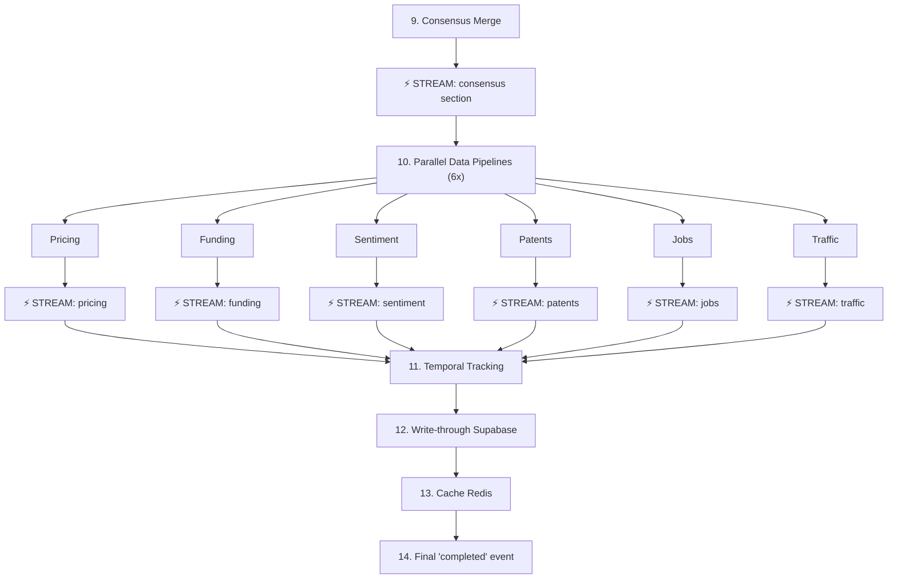

# StartupScope AI — Session 2 Walkthrough

## Summary

Implemented **5 features** (Features 8–12) across Tier 2 (Data Pipelines) and Tier 3 (UX). The pipeline now runs **6 data pipelines in parallel** with **progressive streaming** — each section publishes a WebSocket event the instant it finishes.

---

## Features Implemented

| # | Feature | File(s) | Status |
|---|---------|---------|--------|
| 8 | Patent & IP Scan | [patents.py](file:///Users/likhith./Startup_Scope_AI/backend/app/services/patents.py) | ✅ Complete |
| 9 | Job Posting Signal | [jobs.py](file:///Users/likhith./Startup_Scope_AI/backend/app/services/jobs.py) | ✅ Complete |
| 10 | Web Traffic Intelligence | [traffic.py](file:///Users/likhith./Startup_Scope_AI/backend/app/services/traffic.py) | ✅ Complete |
| 11 | Progressive Streaming | [celery_tasks.py](file:///Users/likhith./Startup_Scope_AI/backend/app/worker/celery_tasks.py) | ✅ Complete |
| 12 | Conversational RAG | [chat_router.py](file:///Users/likhith./Startup_Scope_AI/backend/app/api/chat_router.py) | ✅ Complete |

---

## Files Changed

### New Files (4)
| File | Purpose |
|------|---------|
| [patents.py](file:///Users/likhith./Startup_Scope_AI/backend/app/services/patents.py) | USPTO PatentsView API query + Gemini keyword extraction + IP landscape analysis |
| [jobs.py](file:///Users/likhith./Startup_Scope_AI/backend/app/services/jobs.py) | Firecrawl job search + Gemini role extraction by department + hiring velocity |
| [traffic.py](file:///Users/likhith./Startup_Scope_AI/backend/app/services/traffic.py) | Wayback Machine CDX API + traffic tier estimation + growth trend computation |
| [chat_router.py](file:///Users/likhith./Startup_Scope_AI/backend/app/api/chat_router.py) | POST /api/v1/chat/{validation_id} — RAG-grounded conversational endpoint |

### Modified Files (3)
| File | Changes |
|------|---------|
| [ai_reports.py](file:///Users/likhith./Startup_Scope_AI/backend/app/schemas/ai_reports.py) | Added PatentResult, PatentReport, JobDepartment, CompetitorJobs, JobsReport, CompetitorTraffic, TrafficReport schemas |
| [celery_tasks.py](file:///Users/likhith./Startup_Scope_AI/backend/app/worker/celery_tasks.py) | Expanded Step 10 to 6 parallel pipelines, added progressive streaming via `as_completed()`, consensus streamed before data pipelines |
| [main.py](file:///Users/likhith./Startup_Scope_AI/backend/app/main.py) | Registered chat_router for Feature 12 |

---

## Architecture: Updated Pipeline (Steps 9–14)



## Feature 11: Progressive Streaming Protocol

The frontend receives WebSocket events with this shape as each pipeline completes:

```json
{
  "validation_id": "uuid",
  "status": "processing",
  "section": "pricing",
  "data": { "competitors": [...], "gap_analysis": "..." }
}
```

Possible `section` values: `consensus`, `pricing`, `funding`, `sentiment`, `patents`, `jobs`, `traffic`.

The final event has `"status": "completed"` — this is the "all done" signal.

## Feature 12: Chat Endpoint

```
POST /api/v1/chat/{validation_id}
Content-Type: application/json

{
  "question": "Which competitor has the strongest IP moat?",
  "history": [
    {"role": "user", "content": "How feasible is my idea?"},
    {"role": "assistant", "content": "Based on the analysis..."}
  ]
}
```

**Response:**
```json
{
  "answer": "Based on the patent data, **CompanyX** holds 3 relevant patents...",
  "sources": [
    {"text": "Patent US12345: Method for...", "source_url": null}
  ],
  "tokens_used": 1523
}
```

---

## Data Pipeline APIs Used (All Free)

| Feature | API | Cost | Auth Required |
|---------|-----|------|---------------|
| F8: Patents | USPTO PatentsView | Free forever (US gov) | None |
| F9: Jobs | Firecrawl search | Existing key | Existing |
| F10: Traffic | Wayback Machine CDX | Free forever (non-profit) | None |

---

## Remaining for Session 3

| Tier | Features | Status |
|------|----------|--------|
| Tier 3 | 13. PDF Export, 14. Team Sharing, 15. Comparison, 16. Alerts | Not started |
| Tier 4 | 17. Priority Queues, 18. Observability, 19. Cost Control, 20. Webhooks | Not started |
