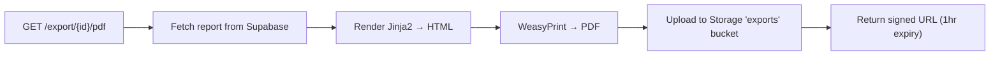

# StartupScope AI — Session 3 Walkthrough

## Summary

Implemented **4 features** (Features 13–16) across Tier 3 (User Experience). Added PDF export, team workspaces, multi-idea comparison, and smart change alerts.

---

## Features Implemented

| # | Feature | File(s) | Status |
|---|---------|---------|--------|
| 13 | PDF Export | [export.py](file:///Users/likhith./Startup_Scope_AI/backend/app/services/export.py), [export_router.py](file:///Users/likhith./Startup_Scope_AI/backend/app/api/export_router.py) | ✅ Complete |
| 14 | Team Collaboration | [workspace_router.py](file:///Users/likhith./Startup_Scope_AI/backend/app/api/workspace_router.py) | ✅ Complete |
| 15 | Comparison Engine | [comparison.py](file:///Users/likhith./Startup_Scope_AI/backend/app/services/comparison.py), [comparison_router.py](file:///Users/likhith./Startup_Scope_AI/backend/app/api/comparison_router.py) | ✅ Complete |
| 16 | Smart Alerts | [alerts.py](file:///Users/likhith./Startup_Scope_AI/backend/app/services/alerts.py) | ✅ Complete |

---

## New Files (6)

| File | Purpose |
|------|---------|
| [export.py](file:///Users/likhith./Startup_Scope_AI/backend/app/services/export.py) | WeasyPrint + Jinja2 PDF generation with dark premium template, Supabase Storage upload, signed URL |
| [export_router.py](file:///Users/likhith./Startup_Scope_AI/backend/app/api/export_router.py) | `GET /api/v1/export/{id}/pdf` → returns signed download URL |
| [comparison.py](file:///Users/likhith./Startup_Scope_AI/backend/app/services/comparison.py) | Gemini comparative scoring matrix (market size, tech difficulty, capital efficiency, competition) |
| [comparison_router.py](file:///Users/likhith./Startup_Scope_AI/backend/app/api/comparison_router.py) | `POST /api/v1/compare` with 2-10 validation IDs |
| [workspace_router.py](file:///Users/likhith./Startup_Scope_AI/backend/app/api/workspace_router.py) | CRUD: create workspace, list, invite by email (Supabase Auth admin), list members |
| [alerts.py](file:///Users/likhith./Startup_Scope_AI/backend/app/services/alerts.py) | Threshold-based alerts: Redis Pub/Sub + mocked SMTP (real when configured) |

## Modified Files (3)

| File | Changes |
|------|---------|
| [requirements.txt](file:///Users/likhith./Startup_Scope_AI/backend/requirements.txt) | Added `weasyprint`, `jinja2` |
| [celery_tasks.py](file:///Users/likhith./Startup_Scope_AI/backend/app/worker/celery_tasks.py) | Added Step 11b: `process_alert()` call after temporal comparison |
| [main.py](file:///Users/likhith./Startup_Scope_AI/backend/app/main.py) | Registered export_router, comparison_router, workspace_router |

---

## New REST Endpoints

| Method | Endpoint | Feature | Auth |
|--------|----------|---------|------|
| `GET` | `/api/v1/export/{validation_id}/pdf` | F13: PDF Export | No |
| `POST` | `/api/v1/compare` | F15: Compare Ideas | No |
| `POST` | `/api/v1/workspaces` | F14: Create Workspace | JWT |
| `GET` | `/api/v1/workspaces` | F14: List Workspaces | JWT |
| `POST` | `/api/v1/workspaces/{id}/invite` | F14: Invite Member | JWT |
| `GET` | `/api/v1/workspaces/{id}/members` | F14: List Members | JWT |

---

## Feature Deep Dives

### Feature 13: PDF Export



The PDF uses a dark premium theme with:
- Gradient header with feasibility score badge (green/yellow/red)
- Meta cards (tokens, cost, validation ID)
- Consensus confidence bar
- Competitor pricing table
- Patent landscape table
- Traffic intelligence table

### Feature 15: Comparison Engine

Gemini scores each idea on 5 dimensions (0–100):

| Dimension | Description |
|-----------|-------------|
| Market Size | How large is the addressable market? |
| Technical Difficulty | How hard to build? (100 = hardest) |
| Capital Efficiency | How cheaply can you launch? (100 = cheapest) |
| Competitive Density | How crowded? (100 = most crowded) |
| Overall Score | Weighted composite recommendation |

Returns per-idea scores, dimension winners, strategic narrative, and final recommendation.

### Feature 16: Smart Alerts

```
Temporal Diff → significance_score > 0.3? 
    → YES: 
        1. Redis Pub/Sub alert (frontend banner)
        2. Email alert (mocked unless SMTP configured)
    → NO: Skip
```

---

## Supabase Tables Required for Session 3

```sql
-- Feature 14: Team Collaboration
CREATE TABLE workspaces (
    id UUID PRIMARY KEY DEFAULT gen_random_uuid(),
    name TEXT NOT NULL,
    created_by UUID NOT NULL REFERENCES auth.users(id),
    created_at TIMESTAMPTZ DEFAULT now()
);

CREATE TABLE workspace_members (
    id UUID PRIMARY KEY DEFAULT gen_random_uuid(),
    workspace_id UUID NOT NULL REFERENCES workspaces(id) ON DELETE CASCADE,
    user_id UUID NOT NULL REFERENCES auth.users(id),
    email TEXT NOT NULL,
    role TEXT NOT NULL DEFAULT 'viewer',
    invited_at TIMESTAMPTZ DEFAULT now(),
    UNIQUE(workspace_id, user_id)
);

-- Feature 13: Supabase Storage bucket
-- Create a bucket named 'exports' in Supabase Storage dashboard
```

---

## Cumulative Feature Inventory (Sessions 1–3)

| Feature | Status |
|---------|--------|
| 1. Multi-Model Consensus | ✅ |
| 2. RAG Grounding | ✅ |
| 3. Self-Heal Structured Output | ✅ |
| 4. Temporal Trend Tracking | ✅ |
| 5. Pricing Intelligence | ✅ |
| 6. Funding Intelligence | ✅ |
| 7. Social Sentiment (stubbed) | ✅ |
| 8. Patent & IP Scan | ✅ |
| 9. Job Posting Signal | ✅ |
| 10. Web Traffic Intelligence | ✅ |
| 11. Progressive Streaming | ✅ |
| 12. Conversational RAG | ✅ |
| 13. PDF Export | ✅ |
| 14. Team Collaboration | ✅ |
| 15. Comparison Engine | ✅ |
| 16. Smart Alerts | ✅ |
| **17. Priority Queues** | ⬜ Session 4 |
| **18. Observability** | ⬜ Session 4 |
| **19. Cost Control** | ⬜ Session 4 |
| **20. Webhooks** | ⬜ Session 4 |
