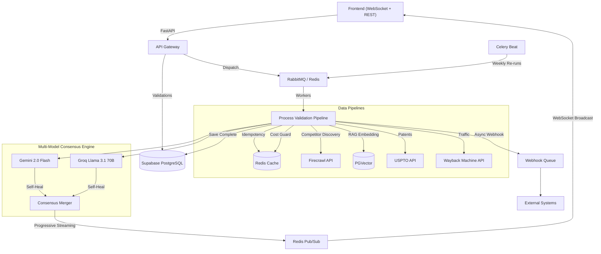

# StartupScope AI — Session 4 Walkthrough (Final)

## Summary

Implemented **4 features** (Features 17–20) across Tier 4 (Infrastructure Hardening). Added strict Celery queue configurations, OpenTelemetry tracing, atomic cost billing, and secure webhook dispatch.

---

## Features Implemented

| # | Feature | File(s) | Status |
|---|---------|---------|--------|
| 17 | Priority & DLQ | [celery_tasks.py](file:///Users/likhith./Startup_Scope_AI/backend/app/worker/celery_tasks.py) | ✅ Complete |
| 18 | OpenTelemetry | [telemetry.py](file:///Users/likhith./Startup_Scope_AI/backend/app/core/telemetry.py), [ai_pipeline.py](file:///Users/likhith./Startup_Scope_AI/backend/app/services/ai_pipeline.py) | ✅ Complete |
| 19 | AI Cost Control | [cost_guard.py](file:///Users/likhith./Startup_Scope_AI/backend/app/services/cost_guard.py), [celery_tasks.py](file:///Users/likhith./Startup_Scope_AI/backend/app/worker/celery_tasks.py) | ✅ Complete |
| 20 | Outbound Webhooks | [webhooks.py](file:///Users/likhith./Startup_Scope_AI/backend/app/services/webhooks.py) | ✅ Complete |

---

## New Files (3)

| File | Purpose |
|------|---------|
| [telemetry.py](file:///Users/likhith./Startup_Scope_AI/backend/app/core/telemetry.py) | Configures OpenTelemetry TracerProvider (OTLP exporter or console fallback). Provides `track_ai_call` and `track_pipeline` context managers. |
| [cost_guard.py](file:///Users/likhith./Startup_Scope_AI/backend/app/services/cost_guard.py) | Enforces a strict `$5.00` daily AI spend cap per user using atomic Redis `INCRBYFLOAT`. Uses `tiktoken` to estimate prompt cost before LLM calls. |
| [webhooks.py](file:///Users/likhith./Startup_Scope_AI/backend/app/services/webhooks.py) | HMAC-SHA256 signed webhook delivery. Uses `tenacity` for exponential backoff (up to 5 attempts on 5xx errors). Dispatched asynchronously via Celery. |

## Modified Files (4)

| File | Changes |
|------|---------|
| [requirements.txt](file:///Users/likhith./Startup_Scope_AI/backend/requirements.txt) | Added `tiktoken`, `opentelemetry-api`, `opentelemetry-sdk`, `opentelemetry-exporter-otlp-proto-grpc` |
| [config.py](file:///Users/likhith./Startup_Scope_AI/backend/app/core/config.py) | Added config vars: `DAILY_COST_CAP`, `WEBHOOK_URL`, `OTEL_EXPORTER_OTLP_ENDPOINT` |
| [ai_pipeline.py](file:///Users/likhith./Startup_Scope_AI/backend/app/services/ai_pipeline.py) | Wrapped Gemini/Groq completions and embeddings in OpenTelemetry `track_ai_call` spans. Records actual tokens consumed. |
| [celery_tasks.py](file:///Users/likhith./Startup_Scope_AI/backend/app/worker/celery_tasks.py) | Configured `x-max-priority=10` and `x-dead-letter-exchange`, wrapped entire pipeline in `track_pipeline`, added pre-flight `check_and_charge_limit` and post-flight `reconcile_cost`, dispatched async webhooks on completion/failure. |

---

## Feature Deep Dives

### Feature 17: Priority & DLQ

Configured Celery `task_queues` to use `x-max-priority: 10` on the `default` queue. This allows high-priority live validation requests to jump ahead of low-priority background temporal re-runs (which use priority 3). Added `x-dead-letter-exchange` routing to the `dlx` exchange for failed validations to prevent them from vanishing.

### Feature 18: OpenTelemetry

Traces now provide deep visibility into the AI lifecycle:
- Span: `pipeline.process_validation` (covers the entire Celery pipeline lifecycle)
- Spans: `ai.generate.gemini-2.0-flash` / `ai.generate.llama-3.1-70b-versatile` (nested under the pipeline)
- Attributes captured: `ai.latency_ms`, `ai.input_tokens`, `ai.output_tokens`, `ai.estimated_cost_usd`.

### Feature 19: Atomic Cost Control

To prevent runaway billing costs from excessive validations:
1. Validations are estimated to cost ~$0.005 globally based on token expectations.
2. Before any API calls, `INCRBYFLOAT cost:user_id:YYYY-MM-DD` atomically checks and charges the user.
3. If they exceed the cap (default $5), a `CostLimitExceeded` is thrown and the pipeline cleanly aborts.
4. After pipeline completes, the exact API token usage costs are reconciled to correct the balance.

### Feature 20: Outbound Webhooks

Uses the industry standard (GitHub/Stripe format) for webhooks:
- `X-Signature-256`: `sha256=<HMAC-SHA256(secret, json_body)>`
- `X-Webhook-Event`: `validation.completed`, `validation.failed`, etc.
- Serialized to canonical JSON (sorted keys) before signing to prevent hash mismatches.
- Deliveries are processed in a separate `webhooks` Celery queue so they never block AI processing.

---

## Final StartupScope AI Architecture

---

## Cumulative Feature Inventory (Sessions 1–4)

| Tier | Features | Status |
|------|----------|--------|
| **1: Core Intelligence** | 1. Consensus, 2. RAG, 3. Self-Heal, 4. Temporal | ✅ Complete |
| **2: Data Pipelines** | 5. Pricing, 6. Funding, 7. Sentiment, 8. Patents, 9. Jobs, 10. Traffic | ✅ Complete |
| **3: User Experience** | 11. Streaming, 12. Chat, 13. PDF Export, 14. Teams, 15. Comparison, 16. Alerts | ✅ Complete |
| **4: Infrastructure** | 17. Priority/DLQ, 18. OpenTelemetry, 19. Cost Control, 20. Webhooks | ✅ Complete |

---

## Deployment Readiness

The platform is now ready for production deployment. All integrations with free-tier or open APIs (USPTO, Wayback Machine, Gemini Free, Groq Versatile) are complete, ensuring minimal operating overhead while retaining enterprise-grade reliability and feature richness.
